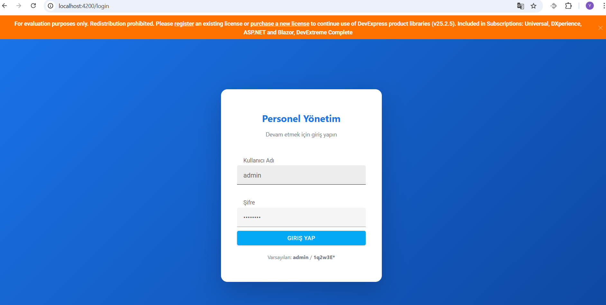
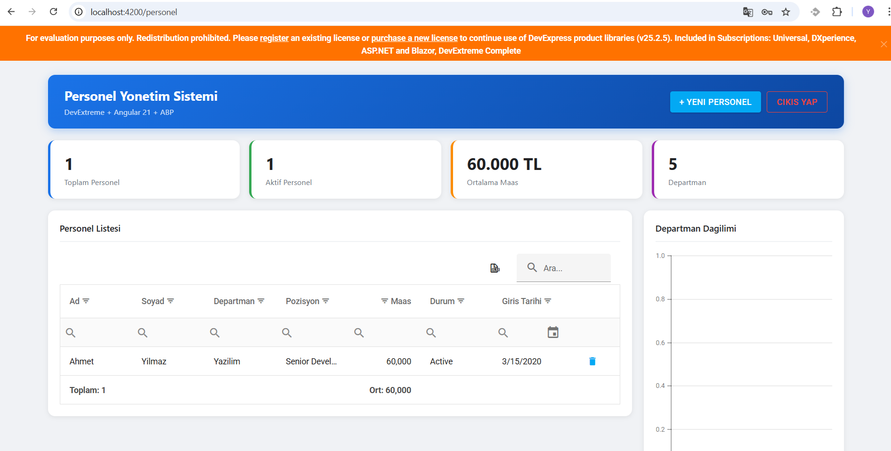

# Personel Yonetim Sistemi / Personnel Management System

A full-stack personnel management application built with **ABP Framework**, **ASP.NET Core**, **Angular 21**, and **DevExtreme**.

---

## 🇹🇷 Türkçe

### Proje Hakkında
Bu proje, kurumsal düzeyde personel yönetimi için geliştirilmiş tam kapsamlı bir web uygulamasıdır. Backend tarafında ABP Framework ile Clean Architecture ve Domain Driven Design prensipleri uygulanmış, frontend tarafında Angular ve DevExtreme bileşenleri kullanılmıştır.

### Teknolojiler
| Katman | Teknoloji |
|---|---|
| Backend Framework | ABP Framework 8.3 |
| Backend Dil | ASP.NET Core / C# / .NET 8 |
| ORM | Entity Framework Core |
| Veritabanı | SQL Server (LocalDB) |
| Auth | OpenIddict (JWT) |
| Frontend Framework | Angular 21 |
| UI Bileşenleri | DevExtreme 25 |
| Mimari | Clean Architecture + DDD |

### Özellikler
- JWT tabanlı kimlik doğrulama (Login / Logout)
- Personel listeleme, ekleme, güncelleme, silme (CRUD)
- DevExtreme DataGrid (arama, filtreleme, sayfalama, export)
- Departman bazlı grafik (DevExtreme Chart)
- Route Guard (yetkisiz erişim engeli)
- HTTP Interceptor (otomatik token yönetimi)
- Soft Delete (silinen kayıtlar veritabanında tutulur)
- Audit Log (kim ekledi, kim güncelledi, ne zaman)

### Kurulum

#### Gereksinimler
- .NET 8 SDK
- Node.js v18+
- SQL Server / LocalDB
- Angular CLI

#### Backend
```bash
cd backend/aspnet-core

# Veritabanını oluştur
dotnet run --project src/PersonelYonetim.DbMigrator

# API'yi başlat
dotnet run --project src/PersonelYonetim.HttpApi.Host
```

API: `https://localhost:44356`
Swagger: `https://localhost:44356/swagger`

#### Frontend
```bash
cd frontend/personel-yonetim

npm install
ng serve
```

Uygulama: `http://localhost:4200`

#### Varsayılan Giriş
```
Kullanıcı Adı : admin
Şifre         : 1q2w3E*
```

### Mimari Yapı
```
backend/aspnet-core/
├── src/
│   ├── PersonelYonetim.Domain              # Entity, Repository Interface, Domain Service
│   ├── PersonelYonetim.Application         # AppService, AutoMapper
│   ├── PersonelYonetim.Application.Contracts # DTO, Interface
│   ├── PersonelYonetim.EntityFrameworkCore # Repository, DbContext
│   ├── PersonelYonetim.HttpApi.Host        # API Host, Swagger
│   └── PersonelYonetim.DbMigrator          # Migration, Seed Data

frontend/personel-yonetim/
└── src/app/
    ├── core/
    │   ├── services/       # AuthService, PersonelService
    │   └── interceptors/   # AuthInterceptor
    └── features/
        ├── login/          # Login sayfası
        └── personel/       # Personel yönetim sayfası
```

---

## 🇬🇧 English

### About
A full-stack enterprise-grade personnel management application demonstrating Clean Architecture, Domain Driven Design, JWT Authentication, and modern Angular development practices.

### Tech Stack
| Layer | Technology |
|---|---|
| Backend Framework | ABP Framework 8.3 |
| Language | ASP.NET Core / C# / .NET 8 |
| ORM | Entity Framework Core |
| Database | SQL Server (LocalDB) |
| Auth | OpenIddict (JWT) |
| Frontend | Angular 21 |
| UI Components | DevExtreme 25 |
| Architecture | Clean Architecture + DDD |

### Features
- JWT-based authentication (Login / Logout)
- Personnel CRUD operations
- DevExtreme DataGrid (search, filter, pagination, export)
- Department distribution chart
- Route Guard (unauthorized access protection)
- HTTP Interceptor (automatic token management)
- Soft Delete
- Audit Logging (created by, modified by, timestamps)

### Setup

#### Requirements
- .NET 8 SDK
- Node.js v18+
- SQL Server / LocalDB
- Angular CLI

#### Backend
```bash
cd backend/aspnet-core

# Create database
dotnet run --project src/PersonelYonetim.DbMigrator

# Start API
dotnet run --project src/PersonelYonetim.HttpApi.Host
```

API: `https://localhost:44356`  
Swagger: `https://localhost:44356/swagger`

#### Frontend
```bash
cd frontend/personel-yonetim

npm install
ng serve
```

App: `http://localhost:4200`

#### Default Credentials
```
Username : admin
Password : 1q2w3E*
```

### Architecture
```
backend/aspnet-core/
├── src/
│   ├── PersonelYonetim.Domain              # Entities, Repository Interfaces, Domain Services
│   ├── PersonelYonetim.Application         # Application Services, AutoMapper Profiles
│   ├── PersonelYonetim.Application.Contracts # DTOs, Service Interfaces
│   ├── PersonelYonetim.EntityFrameworkCore # EF Core Repository Implementations
│   ├── PersonelYonetim.HttpApi.Host        # API Host, Swagger UI
│   └── PersonelYonetim.DbMigrator          # Database Migrations, Seed Data

frontend/personel-yonetim/
└── src/app/
    ├── core/
    │   ├── services/       # AuthService, PersonelService
    │   └── interceptors/   # Auth Interceptor
    └── features/
        ├── login/          # Login page
        └── personel/       # Personnel management page
```

---

## 📸 Screenshots




---

## 📄 License
MIT